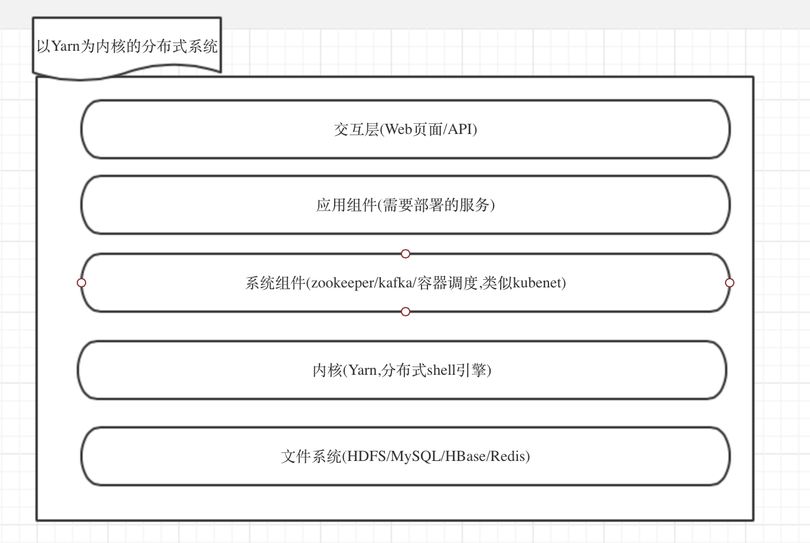
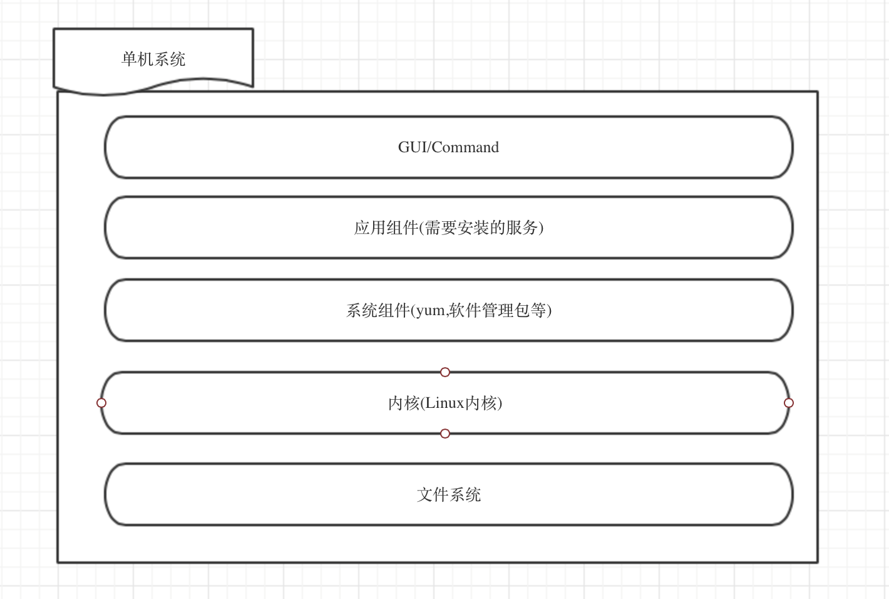
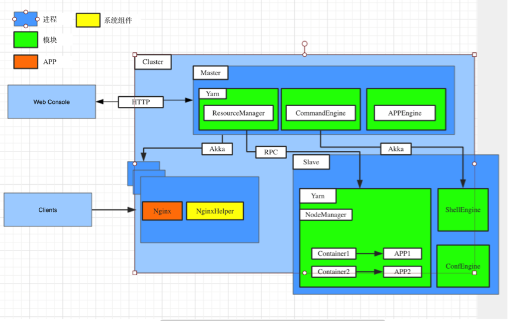

# 分布式操作系统，PAAS的终极之路

## 目录

 * 前言
 * 分布式操作系统的意义
 * 分布式操作系统结构
 * 分布式系统原型-猛犸
 * 分布式操作系统如何现存应用进行交互
 * 分布式操作系统组件
 * 高可用存储支持组件

## 前言

随着技术的发展，构建一个分布式系统需要的前提条件现在都得到满足：

1. 资源管理/调度系统。是的集群所有资源都能够被统一管理和调度起来，我们称之为以资源模型。而传统的则称服务器模型。对应的系统以Yarn/Mesos 为代表
2. 容器技术。解决了两个核心问题：在单机上的应用的资源隔离；应用的部署不再依赖宿主服务器环境。前者是的按资源来调度取代以机器为单位的部署方式。后者是的部署的自动化成为真真切切不打折扣。底层的不同类型的操作系统不再是问题，而不同的应用跑在同一台机器不会互相影响，为资源模型奠定基础。
3. 大量分布式协调组件的诞生，例如Zookeeper,例如消息队列。

## 分布式操作系统的意义

分布式系统具有如下特点：

1. 分布式系统是可编程的。意味着你可以开发一套组件增强系统的功能，然后进行安装而不需要修改系统的内核。

2. 分布式系统统一了应用和组件的概念，使用者只需要了解两类应用：
   
   * 系统组件(Framework)，用来增强系统的功能。典型如动态扩容等功能。
   * 应用程序(APP)，实际业务系统

3. 支持App Store. 所有应用都是APP,部署过程就是APP的安装过程，和现在的单机系统保持了高度一致。即使没接触过分布式系统的人也能轻而易举的部署一个可以服务成千上万人的业务系统。

4. 基于资源模型的部署组件允许你上传一个.image文件(Docker镜像)，指定资源占用两以及实例数即可完成所有部署

5. 分布式系统解决容器跨机器通讯问题

6. 分布式系统提供的应用自我修复机制可以使得应用总是运行在用户期望的状态，譬如维持恒定的用户规定的实例数，资源要求等。

7. 分布式系统自身应该是极度易于部署，不依赖单机操作系统或者本地库

8. 分布式系统的交互应该是区分人机交互和系统之间交互。人机交互应当提供一个友好的web界面，而系统之间交互应该提供一个良好的沟通API.

9. 分布式系统也可以通过分布式Shell引擎支持传统的服务器模式。并且资源模型和传统的服务器模式同时并存，解决各自擅长的问题

## 分布式操作系统结构

分布式操作系统由5层构成，类似传统的单机操作系统：

1. 交互层

     * 外部服务调用，类似单机的IP/Port定位，分布式操作系统通过封装 Nginx/Haproxy 实现。
     * 人机交互界面，类似单机的Shell终端，通过Web化界面实现。

2. 应用层

    * 支持.tar.gz, .image, .git 三种文件的安装。在分布式系统中，用户看到的一切，要么是APP,要么是Framework,他们都可以以规范的方式安装进分布式系统。APP就是属于应用层。而Framework则属于系统级组件，对应用层提供各种隐形功能支持。
    * 以Docker为进程模型进行运行。基于服务器的传统部署组件(Framework) 允许采用其他进程模型，譬如裸机上直接运行一个Java程序。
    * 进程支持异步或者同步同步通讯，通过系统封装的Zookeeper API 来实现协调。
 
3. 系统服务层

     * 部署：基于服务器的传统部署组件(基于内核分布式Shell引擎开发的Framework)；基于资源的部署组件(基于内核Yarn开发的Framework)
     * 应用稳定性支持，基于资源的部署可保证服务实例的数量，保持对所需资源的占用。
     * 存储稳定性支持。实现实现MySQL,Redis这种单Master的高可用性，保证存储的稳定。而类似HBase,Cassandra这些服务本身已经实现了高可用性，不需要分布式系统的系统服务来支撑。
     * 对应用提供依赖性API.譬如安装Hadoop时，需要以来Zookeeper,安装程序可直接调用系统查询是否有可以使用Zookeeper.

4. 文件系统

    * HDFS分布式文件系统
    * MySQL高可用支持事务的存储引擎
    * Redis高可用缓存组件
    * HBase高可用KV存储组件

5. 内核层(Borg)

    *  集成分布式Shell引擎
    *  集成Yarn资源管理引擎

现在，单机和分布式操作系统结构得到了完美统一，下面是单机操作系统：

## 分布式系统原型-猛犸

这是一个典型的master-salve结构。

Master进程包含：

1. ResourceManager.基于Yarn封装的一套组件。
2. CommandEngine，命令系统，通过Akka可以向Slave的ShellEngine发布任何Shell脚本指令
3. APPEngine,APP部署支持，APP信息存储查询等。比如根据安装包的后缀不同会将安装包丢给不同的安装组件去安装等。

Slave进程:

1. NodeManager. 基于Yarn封装的资源管理组件
2. ShellEngine. 执行由Master的CommandEngine发布的指令(目前支持Shell)
3. ConfEngine. 如果系统发现用户安装了Zookeeper,则会请求确认开启，从而支持配置文件管理。

Web Console:

猛犸的默认交互端。通过该Console可以进行应用安装，管理等。

通讯协议：

|调用者|服务者|协议|
| ------------- |:-------------|:-----|
| Web Console | Master |  HTTP |
| CommandEngine | ShellEngine |  AKKA |
| ResourceManager | NodeManager |  HADOOP RPC |

猛犸系统透过APPEngine支持两种应用/资源管理模式：

1. 静态安装模型。  也就是传统的‘指定服务器’部署模式。APPEngine默认透过CommandEngine做这种支持。基本步骤为：

     1. 上传安装包
     2. 选择服务器
     3. 收集参数
     4. 生成配置文件
     5. 分发安装包
     6. 安装
     7. 进入管理界面

   2，3 两个步骤完全配置化。4,5,6步骤如果有需要，应用可以按照指定格式提供相应的脚本即可。

   为了能够管理，如果下载的是【哑应用】，则需要撰写一个指定格式的shell脚本并添加到tar.gz包里即可。通常只需要两三行即可，分布式系统便能够完成启动，关闭，监控进程存活等功能。

   应用的安装信息并不会存储在master上，而是存储在每台Slave上。由Slave通过心跳上报到Master端。静态模型中，Master是完全无状态的。

2. 动态安装模型

   该模式下，所有资源由Yarn内核进行动态分配管理。我们提供了一个DynamicDeploy的系统组件(需要额外安装)。如果用户提交的应用是.image后缀并且跳过服务器选择，则AppEngine会将该安装包交给DynamicDeploy，DynamicDeploy会按下面的流程进行处理：
   1. DynamicDeploy向ResourceManager提交资源资源申请，ResourceManager启动ApplicationMaster
   3. ApplicationMaster启动DynamicDeploy的Driver(Master)
   4. ApplicationMaster向Resource Manager申请资源，Resource Manager根据集群资源情况为其分配YARN Container，
   5. 这些Container会连接Driver。Driver发布启动指令给各个Container.Container会执行download image,load image,run image 三部分指令
   6. run指令会自动添加cpu,内存，磁盘配额。并且给Docker的容器配置一个随机端口
   7. Container会将Docker容器的IP,端口上报给Driver,Driver会将这些发送给APPEngine.
   8. APPEngine会把这些数据发送给Zookeeper或者其他存储介质
   9. Nginx系统组件(需要事先在猛犸中安装)会监听这些变化，更新到Nginx中
   10. 完成部署

这里本质上Container,Nginx系统组件 除了拥有一些额外功能外，都是伴生对象。因为我们安装的大部分应用，都是【哑应用】。

## 分布式操作系统如何现存应用进行交互

容器技术使得所有应用可以被操作系统运行起来。并且可以吻合Yarn内核对资源控制的要求。但是我们可能需要对被容器包括起来应用更细致的控制。
我们先来看两个概念。

1. 哑应用

所谓哑应用指的是无法和分布式系统直接进行交互，分布式系统也仅仅透过容器能进行生命周期的控制，比如关闭或者开启的应用。典型的比如MySQL,Nginx等这些基础应用。他们一般有自己特有的交互方式，譬如命令行或者socket协议或者HTTP协议。

2. 伴生组件

因为有了哑应用的存在，操作系统为了能够和这些应用交互，所以有了伴生组件的存在。这些伴生组件和哑应用具有相同的生命周期。伴生组件其实是哑应用的Proxy,从而使得哑应用可以和分布式系统进行交流。典型的比如，某个服务被关停后，该事件会被操作系统获知，操作系统会将该事件发送给Nginx的伴生组件，伴生组件转化为Nginx能够识别的指令，将停止的服务从Nginx的ProxyBackend列表中剔除。

如果我们只需要对应用进行生命周期控制，而如果你的应用是基于容器的，那么我们只要分布式系统默认提供的伴生组件即可完成大部分功能需求。

* 基于资源的部署方式，需要你将应用容器化。
* 基于传统服务器模式的部署方式，则并不强制要求容器化，我们提供封装了一套完善的Shell脚本引擎，你只要填写两到三行指令就可以完成完成分布式系统对对应应用的生命周期管理。对应用没有任何改动。然而，你需要自己解决应用本身对裸服务器的环境以来，譬如某些本地库。

## 分布式操作系统组件

前面我们提及了分布式系统的分层。我们现在详细看看这些分层的组件的详细情况。

* 分布式调度内核 ，两部分构成，分布式Shell引擎以及Yarn。
* 存储，下面的都会作为操作系统的标准API对外提供，一个应用只要部署到分布式系统中，就有下列存储器可用：
      
     * 分布式文件系统 (HDFS)
     * 支持事物存储MySQL集群
     * NoSQL存储 HBase
     * 内存缓存 Redis

* 进程模型 (以Docker为代表的容器技术)。这块很简单，在分布式操作系统运行的一切都是容器。

* 分布式系统可执行程序。我们采用标准的安装包分发机制。支持下列三种：
        
      *  .tar.gz 普通的解压即可启动的安装包。如果传统方式部署，则仅需添加个两三行的脚本。如果是基于资源调度，则需要做特定的适配。
      *  .git 源码，分布式系统系统可通过类似Maven等构建工具编译即可使用
      *  .image 容器镜像，分布式系统可直接加载并且运行的可执行镜像(推荐)
       
* 服务注册API

    * 两种，基于Zookeeper实现，分布式系统内部的也提供了一个相关注册接口。
    * 任何部署在分布式系统中的应用都会被注册，类似windows注册表
    * 提供HTTP/RPC注册接口

* 进程通讯
     
    * 进程异步通讯模型(消息队列)
    * 进程通讯模型(HTTP/RPC)

*  用户态组件
   
    * 特点为直接基于Yarn/分布式Shell引擎开发
    * 类似单操作系统里的用户态
    * 典型如： Hadoop MR 实现，Spark Yarn 实现，增强了操作系统功能

* 应用程序

    * 多实例
    * 应用的互调需要透过分布式系统
    * 多实例扩容等则需要用户态组件来进行增强

* UI系统(Web化可视界面)

* 系统中的应用程序定位

    * 单机操作系统为 IP+端口
    * 在分布式中，内部定位通过服务注册API,外部调用，则透过Nginx/Haproxy暴露，内部的服务变更(比如扩容后)，系统会自动调整Nginx/Haproxy的配置。

### 高可用存储支持组件

在分布式操作系统中，可提供分布式文件系统(HDFS),也可以提供‘硬件级别’的磁盘，还有高层次支持事务的MySQL集群，高速缓存Redis集群，优秀的KeyValue存储 HBase等。

以MySQL为例，在分布式操作系统中是如何实现高可用的呢？

分布式操作系统中，MySQL 以容器状态运行，文件通过Volumn挂载在实际磁盘中，实现单Master多Slave结构，我们称之为一个Cluster,系统允许多个Cluster存在。

值得注意的是，MySQL这些信息都会在系统的注册表中找到。

我们基于Yarn开发了一套傍生组件，该组件是专门监控这种单Master节点类型的系统，一旦安装了MySQL,系统会自动启用该组件，定时监控Master的可用性，一旦发现Master不可以用，则找到数据最新的Slave，提升为Master,并且变更注册表信息(如IP,端口等)，所有使用该MySQL的服务组件都会得到通知，从而实现动态变更。

同理，Redis Cluster也是通过相同的方式实现高可用。

### 应用安装

前面我们提到，分布式操作系统支持三种类型的APP，分别为

1. .tar.gz  比如Hadoop
2. .image  docker 镜像文件
3. .git  git源码

这些APP会放在分布式系统中的AppStore中。用户可以制作好上面的APP安装包后上传到AppStore中，也可以直接使用已经制作好的安装包。

分布式系统针对类似Hadoop,或者MySQL,或者普通的Web应用都有单独的安装策略。

###  服务注册API

基于Zookeeper集群实现高可用。由系统提供Http API实现注册。注册机制为URL地址。每个服务都由一个URL构成，URL可以使用URL参数进行区分。任何一个安装的应用都会将自己的信息注册到该API上。

### 进程通讯

涉及到分布式系统内部通讯以及分布式系统间通讯。

系统内部异步通讯通过内置的Kaffka来实现。对应用来说是透明的。
同步通讯则直接使用Http/RPC即可。

都需要透过服务注册API，也就是必须经过分布式操作系统。

而如果外部，比如用户浏览器，或者第三方不在分布式操作系统的应用想调用系统内部服务，则透过已经封装好的 Nginx/Haproxy 来完成。

### MapReduce/Spark/MPI等工具在分布式系统的定位

Yarn的可编程性让我们可以开发一些系统组件，从而让系统有了新的能力，比如MapReduce/Spark 等，让分布式系统有了执行批量离线(或者准实时)的功能。我们认为这是对分布式系统的一种增强。因为这套应用是直接基于分布式系统内核编程的。

### 分布式系统的自动容量规划机制

我们发现单机桌面软件运行时，大部分情况是不需要你写资源申请的。而事实上，即使在实际的线上部署，部署者也很难确切的知道我应该要多少CPU,多少内存比较合理，当然，磁盘理论可以预估的。

前面我们提到，类似于Windows的注册表，一个进程启动后需要将自己告知系统，而且他如果要调用其他的进程需要通过分布式系统的注册API来完成，一旦获得依赖的其他进程信息，则通过操作系统提供的异步通讯模型-消息队列，或者直接的通讯模型(HTTP/RPC)来完成实际的数据传递。

由此，我们可以知道，当一个服务被启动，分布式系统很容获取到这个应用的依赖，包括对外的RPC调用,Http调用，数据库调用，缓存调用（如果应用框架支持，这些调用关系是可以通过配置文件静态分析出来的)。这和安卓一样，一个应用需要申明他是否需要联网，是否需要自启动，是否需要XXX。用户只需要提供一个预估调用量，或者需要他能承受的一个调用量给系统，系统结合这些数值，可以自动计算出需要启动多少个容器，配置多少CPU,多少内存，计算的方式非常多，其中还有一个小技巧，是可以参看有着类似外部依赖的已经部署在线上的服务，参看他的数值。当然，用户也可以直接通过配置文件告诉系统自己需要的资源申请。

系统一旦计算出来后，用户确认即可，防止出现错误，这个时候，系统采用的是贪婪算法，它会采用比预估值大一倍的容量来启动这个服务群集。接着根据实际运行结果，比如一周的运行数据(各个容器的CPU,内存等))，来确定一个更合适的值，这个时候可以通过服务的自动伸缩性来解决减少服务的。
